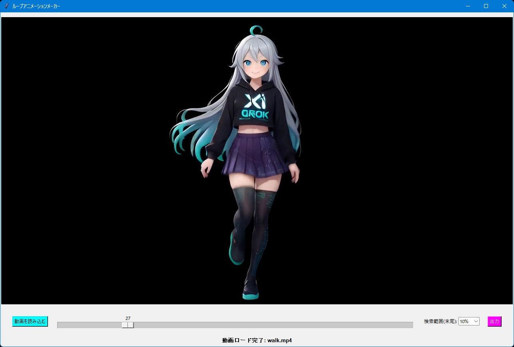

# ループアニメーションメーカー

## 機能概要

指定した開始フレームに最も似た後半フレームを自動検索し、自然なループアニメーション動画を簡単に作成できるTkinter+OpenCV製GUIツールです。

### 主な機能

- MP4動画を読み込み、スライダーで開始フレームを選択
- 動画の後半部分（指定した割合）から開始フレームに一番似ているフレームを自動検索（グレースケール差分で評価）
- 開始フレームからそのベストマッチフレームまでを自然なループ動画として出力
- ドラッグ&ドロップ対応、リアルタイムプレビュー、進捗表示付き

### 一言で言うと

「自動ループアニメーションメーカー」

## 使い方

1. **アプリを起動する**

    ターミナルで`python loop-animation-maker.py`を実行（事前に`pip install tkinterdnd2 opencv-python pillow numpy`を済ませておけよ）。

2. **動画を読み込む**

    「動画を読み込む」ボタンを押すか、ウィンドウにMP4ファイルをドラッグ&ドロップ。

3. **開始フレームを選択する**

    シークバーを動かしてループの開始位置を決める。プレビューがリアルタイムで更新される。

4. **検索範囲を設定する**

    「検索範囲(末尾)」のコンボボックスで、後半何％の範囲から似たフレームを探すかを選択（デフォルト10%）。

5. **出力を実行する**

    「出力」ボタンをクリック。自動で似ているフレームを検索し、開始〜ベストマッチフレームまでの動画を`loop-YYYYMMDDHHMMSS.mp4`として保存。

## 必要環境

- Python 3.10以上
- 必要なライブラリはソースコードの先頭に書いてあります。

## ライセンス

**MIT License** で公開しています。  
ご自由に使って、改変して、参考にしてください。  
ただし**自作発言はNG**でお願いします。