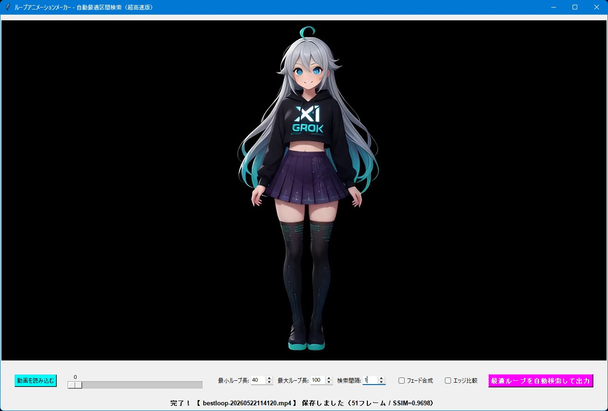

# ループアニメーションメーカー

## 機能概要

MP4動画から自然にループしそうな最適区間を自動で探して、高速でシームレスループアニメを作成できるTkinter+OpenCV製GUIツールです。

### 主な機能

- 動画全体からSSIM（またはエッジ比較）で自然にループしそうな区間を高速検索
- 上位複数候補（BEST + 2位～30位程度）を保持し、ユーザーが希望の順位を選択して出力可能
- 近似区間の間引き処理で「ほぼ同じループばかり」になるのを防ぐ
- フェード合成のON/OFFと長さ調整機能（クロスフェードでつなぎ目を滑らかに）
- 全フレームを事前に小さくリサイズしてメモリ保持する超高速化
- 最小/最大ループ長、検索間隔、エッジ比較モードも細かく調整可能

## FFmpegについて

このツールは内部でFFmpegを使用しています。
ツールと同じフォルダにffmpeg.exeを置いてください。

FFmpegの公式ダウンロード先

FFmpeg 公式サイト (Downloadページ): https://ffmpeg.org/download.html

### 一言で言うと

「複数候補選択型 自動最適ループアニメメーカー」

## 使い方

1. **アプリを起動する**

    ターミナルで`python loop-animation-maker-v2.py`を実行（事前に`pip install tkinterdnd2 opencv-python pillow scikit-image numpy`を済ませておけよ）。

2. **動画を読み込む**

    「動画を読み込む」ボタンまたはウィンドウにMP4ファイルをドラッグ＆ドロップ。

3. **検索パラメータを設定する**

    - 最小ループ長 / 最大ループ長
    - 検索間隔
    - 生成候補（BEST / 2位 / 3位 …）
    - フェード合成のON/OFFとフェード長
    - エッジ比較モード

4. **最適ループを自動検索して出力**

    「最適ループを自動検索して出力」ボタンをクリック。検索完了後、指定した順位のループ動画（例: `best-loop-...`または`rank03-loop-xfade-...`）が保存される。

## 必要環境

- Python 3.10以上
- 必要なライブラリはソースコードの先頭に書いてあります。

## ライセンス

**MIT License** で公開しています。  
ご自由に使って、改変して、参考にしてください。  
ただし**自作発言はNG**でお願いします。

This tool uses FFmpeg (https://ffmpeg.org/). FFmpeg is licensed under the LGPL/GPL. See https://www.ffmpeg.org/legal.html for details.
